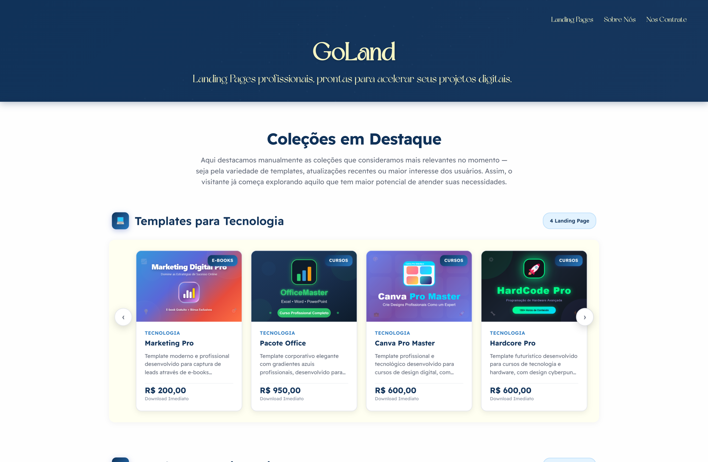
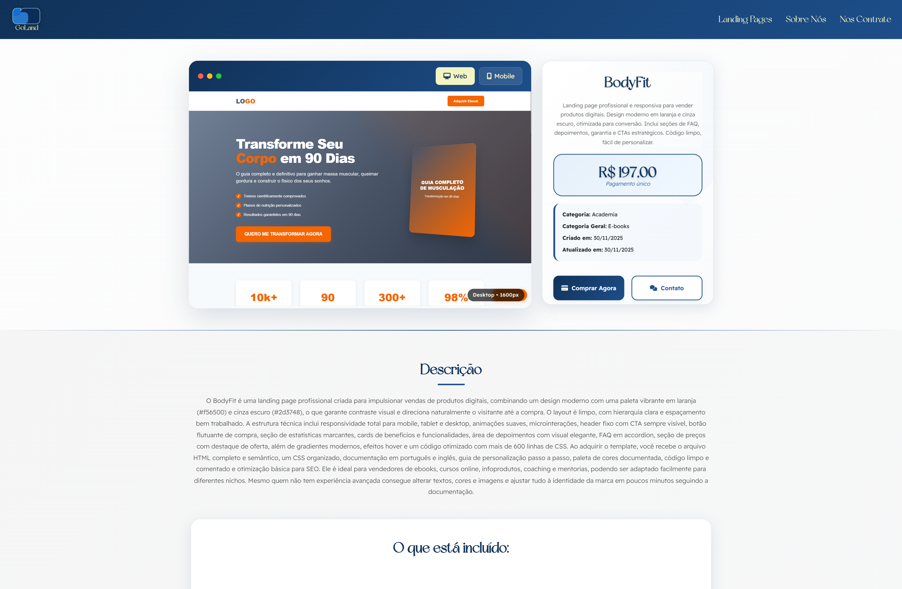
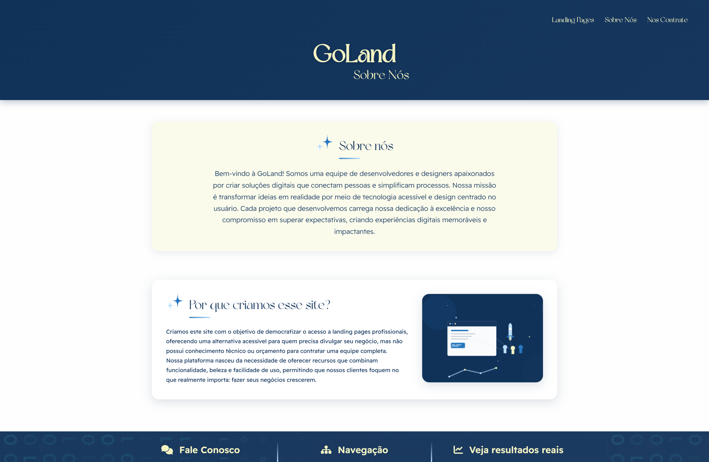

# 🚀 GoLand - Plataforma de Templates para Landing Pages


**Democratizando a criação de landing pages profissionais**

[](https://www.djangoproject.com/)
[](https://www.python.org/)
[](https://developer.mozilla.org/en-US/docs/Web/JavaScript)
[](https://developer.mozilla.org/en-US/docs/Web/HTML)
[](https://developer.mozilla.org/en-US/docs/Web/CSS)

[Demo](#) • [Documentação](./docs/TCC_GoLand.pdf) • [Contato](#contato)

---

## 📋 Sobre o Projeto

**GoLand** é uma plataforma web completa desenvolvida como Trabalho de Conclusão de Curso (TCC) que resolve um problema real do mercado digital: **a dificuldade de pequenos e médios empreendedores em criar landing pages profissionais** devido aos altos custos e falta de conhecimento técnico.

### 🎯 O Problema

Pesquisas mostram que:
- **55% dos e-commerces** enfrentam escassez de desenvolvedores back-end qualificados [(E-Commerce Brasil, 2023)](https://www.ecommercebrasil.com.br)
- **55% dos pequenos empreendedores** veem a falta de pessoal qualificado como maior obstáculo à inclusão digital [(Sebrae, 2022)](https://agenciasebrae.com.br)
- Páginas mal elaboradas **reduzem confiança, autoridade e conversão**, prejudicando vendas

### 💡 A Solução

Uma plataforma que oferece **templates prontos e personalizáveis** de landing pages, permitindo que vendedores online criem páginas de conversão profissionais sem conhecimento técnico, otimizando tempo e recursos.

---

## ✨ Funcionalidades

### 🎨 Para Usuários
- ✅ **Vitrine de Templates** - Catálogo organizado por categorias (Cursos, E-books, Consultorias)
- ✅ **Sistema de Busca e Filtros** - Encontre o template ideal rapidamente
- ✅ **Pré-visualização Responsiva** - Veja como ficará em web e mobile antes de comprar
- ✅ **Coleções em Destaque** - Templates Premium organizados por categoria
- ✅ **Sistema de Contato** - Comunicação direta com desenvolvedores

### 🛠️ Técnicas
- ✅ **Interface Responsiva** - Adaptação perfeita para todos os dispositivos
- ✅ **Sistema de Validação** - Coleta segura de informações do usuário
- ✅ **E-mails Personalizados** - Confirmações e notificações automáticas
- ✅ **Painel Administrativo** - Gerenciamento completo via Django Admin
- ✅ **Banco de Dados Estruturado** - SQLite com ORM Django

---

## 🖼️ Screenshots

<details>
<summary>📸 Clique para ver as imagens do projeto</summary>

### Página Principal

*Tela inicial com navegação intuitiva e destaque para templates*

### Catálogo de Templates

*Vitrine completa com filtros e sistema de busca*

### Visualização do Produto

*Pré-visualização responsiva e informações detalhadas*

### Sobre Nós

*Apresentação da equipe e missão do projeto*

### Contato

*Formulário de contato e serviços oferecidos*

</details>

---

## 🏗️ **Arquitetura do Projeto**

```
GolandTCC/
├── core/                    # App principal Django
│   ├── migrations/          # Migrações do banco de dados
│   ├── static/              # Arquivos estáticos (CSS, JS, imagens)
│   ├── templates/           # Templates HTML
│   ├── templatetags/        # Template tags customizadas
│   ├── admin.py            # Configuração do Django Admin
│   ├── apps.py             # Configuração da aplicação
│   ├── models.py           # Modelos de dados
│   ├── views.py            # Lógica de visualização
│   ├── urls.py             # Rotas da aplicação
│   └── tests.py            # Testes unitários
├── goland/                  # Configurações do projeto
│   ├── settings.py         # Configurações gerais
│   ├── urls.py             # URLs principais
│   └── wsgi.py             # Configuração WSGI
├── goland_tcc/             # Configurações do projeto
│   ├── include/            # Bibliotecas Python
│   ├── Lib/                # Dependências
│   └── Scripts/            # Scripts de execução
├── media/                   # Arquivos de mídia (uploads)
│   ├── categorias/         # Imagens de categorias
│   └── produtos/           # Imagens de produtos
├── db.sqlite3              # Banco de dados SQLite
├── manage.py               # Script de gerenciamento Django
└── requirements.txt        # Dependências do projeto
```

---

## 🛠️ Tecnologias Utilizadas

### Backend
- **Python 3.x** - Linguagem principal
- **Django 4.x** - Framework web robusto
  - Django ORM para banco de dados
  - Sistema de autenticação integrado
  - Painel administrativo
- **SQLite** - Banco de dados (desenvolvimento)

### Frontend
- **HTML5** - Estrutura semântica
- **CSS3** - Estilização responsiva
- **JavaScript (Vanilla)** - Interatividade e validações
  - Validação de formulários em tempo real
  - Navegação dinâmica
  - Pré-visualização de templates

### Desenvolvimento
- **Git & GitHub** - Controle de versão
- **VS Code** - IDE principal
- **Django Debug Toolbar** - Debugging

---

## 🚀 Como Executar o Projeto

### Pré-requisitos
```bash
Python 3.8+
pip
virtualenv (recomendado)
```

### Instalação

1. **Clone o repositório**
```bash
git clone https://github.com/JhanaSardinha/goland.git
cd goland
```

2. **Crie e ative o ambiente virtual**
```bash
# Windows
python -m venv venv
venv\Scripts\activate

# Linux/Mac
python3 -m venv venv
source venv/bin/activate
```

3. **Instale as dependências**
```bash
pip install -r requirements.txt
```

4. **Configure o banco de dados**
```bash
python manage.py makemigrations
python manage.py migrate
```

5. **Crie um superusuário (opcional)**
```bash
python manage.py createsuperuser
```

6. **Execute o servidor**
```bash
python manage.py runserver
```

7. **Acesse no navegador**
```
http://localhost:8000
```

---

## 📊 Modelagem do Banco de Dados

### Principais Modelos

**Produto**
```python
- id (PK)
- nome
- descricao
- preco
- categoria (FK)
- imagem
- slug
- ativo
- data_criacao
```

**Categoria**
```python
- id (PK)
- nome
- descricao
- slug
```

**Contato**
```python
- id (PK)
- nome
- email
- mensagem
- data_envio
```

---

## 👥 Equipe de Desenvolvimento

Projeto desenvolvido por estudantes do **Ensino Médio Integrado ao Técnico em Desenvolvimento de Sistemas** da **ETEC João Maria Stevanatto - Centro Paula Souza**.

**Desenvolvedores:**
- Isabella Pereira Silva
- Isadora Soliani Lima
- **Jhanaina Sardinha** ⭐ *(Responsável por 90% da programação)*
- João Henrique Saraiva Gardinali

**Orientador:** Prof. Jonas José Oliveira Duzo

**Duração:** 9 meses (mar-nov/2025)

---

## 🎓 Contexto Acadêmico

Este projeto foi desenvolvido como **Trabalho de Conclusão de Curso (TCC)** do Ensino Médio Técnico em Desenvolvimento de Sistemas.

### Objetivos Alcançados
✅ Solucionar problema real do mercado digital  
✅ Aplicar conhecimentos técnicos adquiridos  
✅ Desenvolver solução escalável e profissional  
✅ Trabalhar metodologia de pesquisa aplicada  
✅ Implementar boas práticas de desenvolvimento  

### Documentação Completa
📄 [Baixar TCC completo (PDF)](./docs/TCC_GoLand.pdf)

---

## 📈 Resultados e Conquistas

### Métricas Técnicas
- ✅ **Interface 100% Responsiva** - Mobile, Tablet, Desktop
- ✅ **Performance Otimizada** - Carregamento rápido
- ✅ **Código Limpo** - Seguindo padrões Django
- ✅ **Segurança** - Validações e proteção contra SQL Injection

### Impacto do Projeto
- 🎯 Democratiza acesso à criação de landing pages
- 💰 Reduz custos para pequenos empreendedores
- ⏱️ Otimiza tempo de desenvolvimento
- 📈 Aumenta potencial de conversão

---

## 🔮 Roadmap - Próximas Funcionalidades

### Em Desenvolvimento
- [ ] Integração com gateways de pagamento (Stripe, PagSeguro)
- [ ] Editor de templates no próprio site
- [ ] Sistema de autenticação de usuários
- [ ] Dashboard de analytics para vendedores

### Planejado
- [ ] API RESTful para integrações
- [ ] Marketplace de templates de terceiros
- [ ] Suporte multilíngue
- [ ] Migração para PostgreSQL

---

## 📞 Contato

**Jhanaina Sardinha**

[](https://linkedin.com/in/jhana-sardinha)
[](https://github.com/JhanaSardinha)
[](mailto:vtjhana@gmail.com)

---

## 🙏 Agradecimentos

- ETEC João Maria Stevanatto e Centro Paula Souza
- Professor Orientador Jonas José Oliveira Duzo
- Família e amigos pelo apoio
- Comunidade Django pelo framework incrível

---

**💚 Desenvolvido com dedicação pela equipe GoLand**

*"O maior inimigo do conhecimento não é a ignorância, é a ilusão do conhecimento." – Stephen Hawking*


